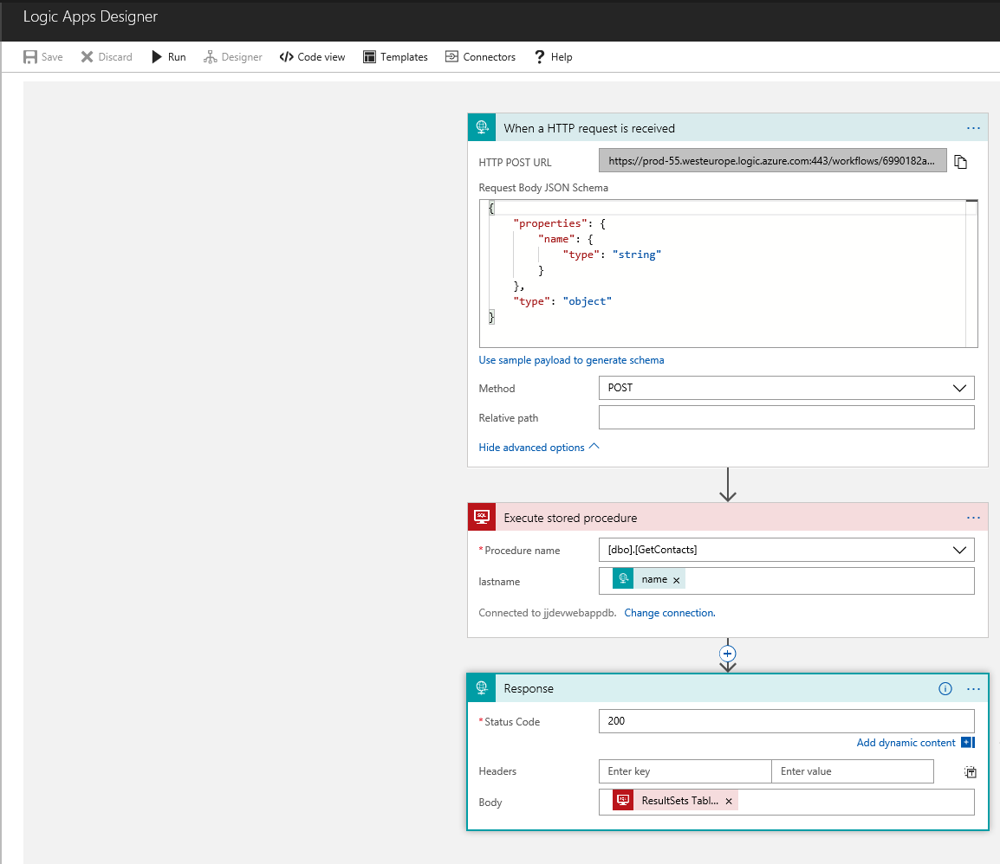
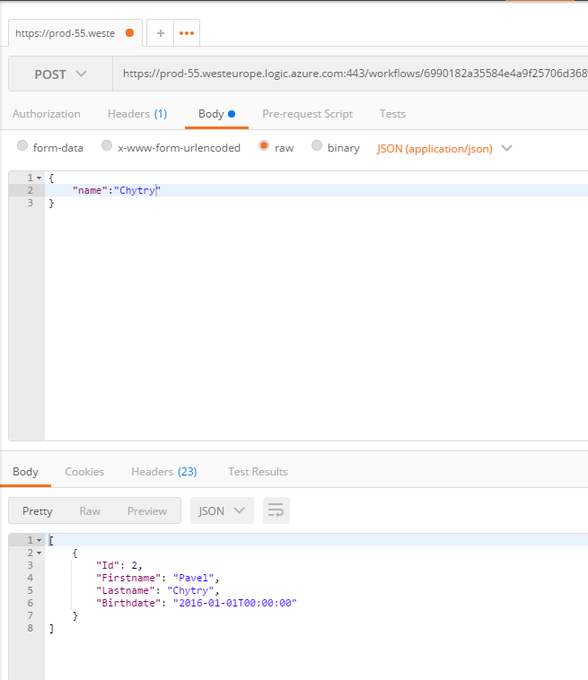
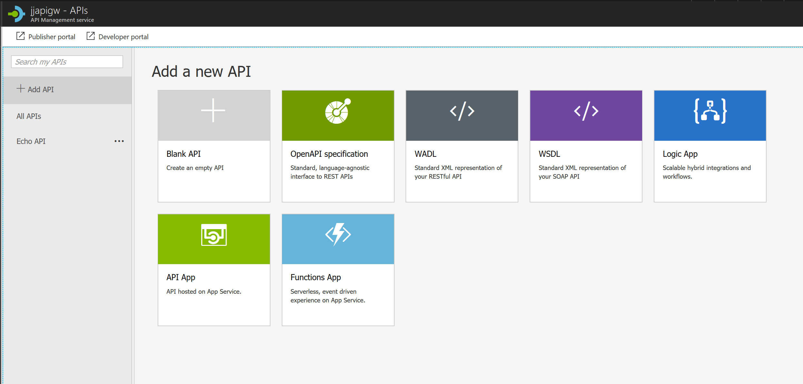
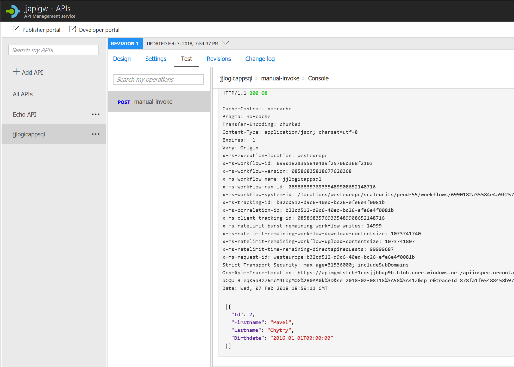

# JJ Azure LogicApps for API
This sample shows how to build REST API function getting data from Microsoft SQL server.

LogicApps using different connectors to connect data.

You need very limited development skills only.

Serialized code is attached in [logicapp.json](logicapp.json). You can use it for e.g. version control.
SQL stored procedure is simple, without any modifications (see [sp.sql](sp.sql))

## Logic App Designer
Graphical designer for dataflow. As you can see, everything is desighned graphically. Parameters and returnvalues are listed as dynamic content.

Steps:
1. Define JSON schema for your input
2. Call SQL stored procedure
3. Return data

## Call function
I'm using Postman to call LogicApp function

# What next ? Protect your API
Use Azure API management service to publish your API - secure it and configure authentication, thresholds, caching etc.
See [more features](https://azure.microsoft.com/en-us/services/api-management/)

Integrate LogicApp is more than easy, just to select LogicApp

Test it, it's working !
